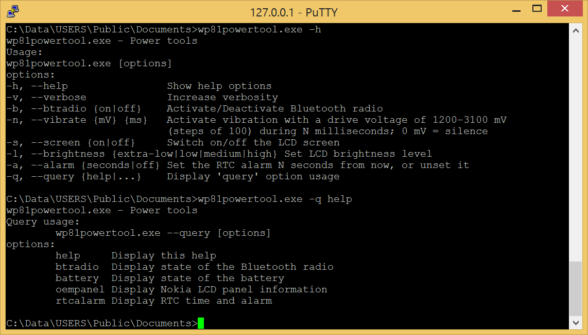
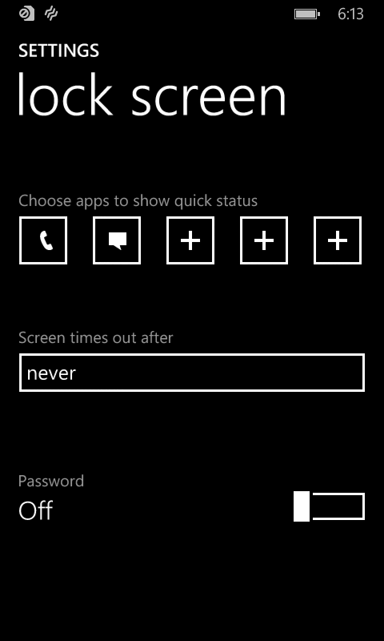
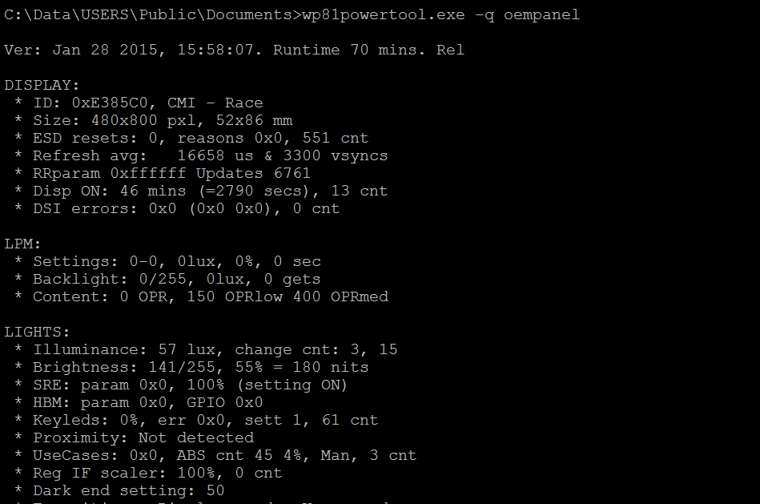

# Wp81Powertool

Adds some other usages compared to the existing powertool.exe of Windows Phone 8.1  
Uss vscode+llvm+cmake to build the .exe  

## Usage

### Bluetooth

Leverages the COM BtConnectionManager interfaces to turn on/off the Bluetooth radio or query its current state.

### Vibration

Uses the IoctlCode IOCTL_PM_VIB_CONTROL_REGISTER of the Qualcomm PMIC driver (`\\.\QCOMPMIC`) to make your phone vibrate with a given drive voltage (1200-3100 mV, in steps of 100 mV) during a given number of milliseconds. A voltage of 0 keeps the motor off during the given duration (a silence).  
Example: `wp81powertool.exe --vibrate 2500 500`

### Battery

Leverages the Windows Runtime "Windows.Phone.Devices.Power.Battery" interfaces to query the remaining charge of the battery.

### Screen

Use some IoctlCodes of the "oempanel" driver.

> [!NOTE]
> The on/off action doesn't work when the screen times out.  
> The app [WPTweaker](https://github.com/sensboston/WPTweaker) ([binary here](https://xdaforums.com/t/xap-source-wptweaker-registry-tweaker-for-wp8-1.3147272/)) can add a new entry "never" in the dropdown list in order to deactivate this timeout.  
> 

Example of result from the `--query oempanel`. This report is entirely generated by the "oempanel" driver.  

### RTC alarm

Use some IoctlCodes of the Qualcomm PMIC driver "qcpmic8930" (`\\.\QCOMPMIC`), see [wp81PmicTool](https://github.com/fredericGette/wp81PmicTool).  
`--alarm {seconds}` sets the alarm 0 of the PMIC RTC N seconds from now (`IOCTL_PM_RTC_ENABLE_ALARM`), `--alarm off` unsets it (`IOCTL_PM_RTC_DISABLE_ALARM`), and `--query rtcalarm` displays the RTC time, the alarm time and the alarm status.
  
## Deployment

- [Install a telnet server on the phone](https://github.com/fredericGette/wp81documentation/tree/main/telnetOverUsb#readme), in order to run the application.  
- Manually copy the executable from the root of this GitHub repository to the shared folder of the phone.
> [!NOTE]
> When you connect your phone with a USB cable, this folder is visible in the Explorer of your computer. And in the phone, this folder is mounted in `C:\Data\USERS\Public\Documents`  
