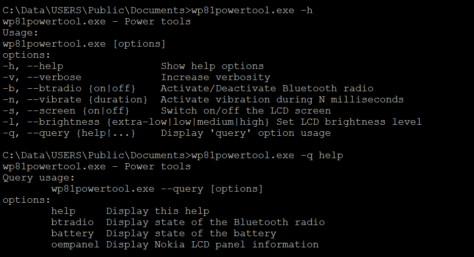

# Wp81Powertool

Adds some other usages compared to the existing powertool.exe of Windows Phone 8.1

## Usage

### Bluetooth

Leverages the COM BtConnectionManager interfaces to turn on/off the Bluetooth radio or query its current state.

### Vibration

Leverages the Windows Runtime "Windows.Phone.Devices.Notification.VibrationDevice" interfaces to make your phone vibrate.

### Battery

Leverages the Windows Runtime "Windows.Phone.Devices.Power.Battery" interfaces to query the remaining charge of the battery.

### Screen

Use some IoctlCodes of the "oempanel" driver.

> [!NOTE]
> The on/off action doesn't work when the screen times out.  
> The app [WPTweaker](https://github.com/sensboston/WPTweaker) ([binary here](https://xdaforums.com/t/xap-source-wptweaker-registry-tweaker-for-wp8-1.3147272/)) can add a new entry "never" in the dropdown list in order to deactivate this timeout.  
> 
  
## Deployment

- [Install a telnet server on the phone](https://github.com/fredericGette/wp81documentation/tree/main/telnetOverUsb#readme), in order to run the application.  
- Manually copy the executable from the root of this GitHub repository to the shared folder of the phone.
> [!NOTE]
> When you connect your phone with a USB cable, this folder is visible in the Explorer of your computer. And in the phone, this folder is mounted in `C:\Data\USERS\Public\Documents`  
